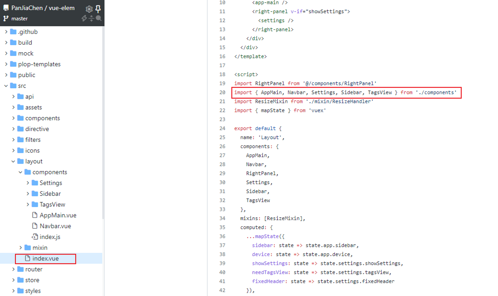
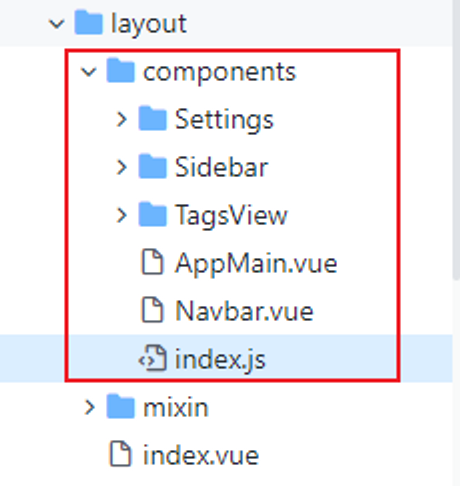

# 我的积累

## ssh 连接报错

### ssh远程连接主机报错:Someone could be eavesdropping on you right now (man-in-the-middle attack)!

解决: 重新生成远程主机信息，命令如下:

```shell
ssh-keygen -R [远程主机IP]
```

### Permission denied (publickey,gssapi-keyex,gssapi-with-mic) 解决方法

```shell
1. sudo vim /etc/ssh/sshd_config

2. 增加如下修改
PasswordAuthentication yes
PermitRootLogin yes

3. 重启sshd
sudo systemctl restart sshd 或 service sshd restart

4. 去对应的云服务器平台重置密码
```

## 服务器部署

1. 购买服务器实例
2. 如果服务器是 centOS 7.x(自带 yum, 如果服务器是 centOS 8, 则自带了 dnf, 无须安装), 如需要安装 dnf, 可执行以下命令:
    1. 需要先启用 EPEL 存储库: yum install epel-release -y
    2. yum install dnf -y
3. 通过 dnf 安装 nodejs: dnf install nodejs
4. 安装 nginx: dnf install -y nginx
5. 启动 nginx: systemctl start nginx.service
6. centOS 中 nginx 常用命令
    1. systemctl stop nginx.service // 停止 Nginx 服务
    2. systemctl restart nginx.service // 重启 Nginx 服务
    3. systemctl reload nginx.service // 重新加载 Nginx 配置文件，然后重启 Nginx
    4. systemctl status nginx.service // 查看状态
    5. systemctl enable nginx.service // 设置开机自启动
    6. systemctl disable nginx.service // 停止开机自启动
 7. 在 /etc/nginx/nginx.conf 下配置服务:
```txt
server {
		listen       8080;
		listen       [::]:8080;
		server_name  _;
		root         /usr/share/nginx/html;
	# Load configuration files for the default server block.
    include /etc/nginx/default.d/*.conf;

    error_page 404 /404.html;
    location = /404.html {
    }

    error_page 500 502 503 504 /50x.html;
    location = /50x.html {
    }

		location / {
        root   /home/vue3-cloud-music;
				try_files $uri $uri/  /index.html;
        index  index.html;
  	}
}
```
8. 服务器是 centOS 7.x 的版本的 mysql 安装
```shell
yum install mysql //通过yum包管理器安装mysql客户端，该客户端可用于连接到MySQL服务器并执行各种操作。

yum install mysql-devel //通过yum包管理器安装mysql开发库，其中包含MySQL C API、头文件和库文件等开发工具。这些工具可用于开发与MySQL数据库交互的应用程序。

wget http://dev.mysql.com/get/mysql80-community-release-el7-5.noarch.rpm //使用wget命令从MySQL官网下载了一个名为“mysql80-community-release-el7-5.noarch.rpm”的RPM软件包。

rpm -ivh mysql80-community-release-el7-5.noarch.rpm //使用rpm命令将上面下载的RPM软件包安装到CentOS 7操作系统中。

yum install mysql-community-server //使用yum包管理器来安装MySQL社区版服务器。这个命令会自动下载和安装MySQL服务器以及相关的依赖项，并启动服务
```
注: 如果已经安装了 MySQL 客户端和开发库，那么第一行和第二行的代码就可以省略。如果已经添加了 MySQL 官方源，那么第三行的代码也可以省略。但如果是全新的系统，则需要执行所有这些命令来安装 MySQL 数据库。

开启MySQL后台服务:
```shell
systemctl start mysqld
```
随着系统⼀起启动:
```shell
systemctl enable mysqld
```

查看MySQL服务：active (running)表示启动成功(以下二者选一个):
```shell
systemctl status mysql

ps -ef | grep mysql
```

mysql8 初次安装后，需要先通过以下命令查看密码:
```shell
`cat /var/log/mysqld.log | grep password`
```

mysql8 修改密码方式:
```shell
alter user 'root'@'localhost' identified by '这里填你要的密码';
```

在⾃⼰的电脑上连接 MySQL(也就是和 MySQL 建⽴远程连接, ⽐如直接使用 Navicat ⼯具连接 MySQL):
```shell
use mysql;
select host, user from user; // 查看user表中，连接权限，默认看到root是localhost
update user set host = '%' where user = 'root'; // 修改权限
配置3306的安全组
修改完成后 还需要刷新一下服务配置，不然修改不会生效
mysql> FLUSH PRIVILEGES;
```
9. 数据库迁移
    1. 在服务器 MySQL 中创建和本地同名的数据库;
    2. 在 Navicat 中本地 MySQL 直接导出数据库;
    3. 在 Navicat 中服务器 MySQL 中执⾏ MySQL(如果运行报错则将"在每个运行中运行多个查询"的勾去掉).

## 开发技巧
1. 在移动端上，使用`overflow-y:scorll`属性时，你会发现滚动的效果很木，很慢，这时候可以使用`-webkit-overflow-scrolling: touch`这个属性，让滚动条产生滚动回弹的效果，就像 ios 原生的滚动条一样流畅。
2. 如果 api 名和 method 名相同, 可以在 method 前加 _ 来区分(Vue)
3. audio 标签不加任何属性, 在页面就不会显示该元素
4. `xxx().then(res ⇒ {})` 可以优化为 `xxx().then(({data = {}} ⇒ {} )`
5. 开发前统一: border border-radius color 变量

## 查看 npm 源
```txt
npm config get registry  // 查看npm当前镜像源

npm config set registry https://registry.npm.taobao.org/  // 设置npm镜像源为淘宝镜像

yarn config get registry  // 查看yarn当前镜像源

yarn config set registry https://registry.npm.taobao.org/  // 设置yarn镜像源为淘宝镜像
```

## 生成 private.key 和 public.key


## 对象转原始值
Number(xxx)
1. 如果 xxx 的 valueOf 返回原始值，直接 Number 包装后返回
2. 如果 valueOf 返回对象，去找 toString 方法
3. 如果 toString 方法返回原始值，直接 Number 包装后返回
4. 如果重写的 toString 返回对象，直接报错
5. 如果没有重写 toString，调用 Object.prototype 上的 toString 方法

## 函数预编译步骤
1. 创建 AO 对象，执行期上下文。
2. 寻找函数的形参和变量声明，将变量和形参名作为 AO 对象的属性名，值设定为 undefined.
3. 将形参和实参相统一，即更改形参后的 undefined 为具体的形参值。
4. 寻找函数中的函数声明，将函数名作为 AO 属性名，值为函数体。

## 切割含 children 的数组
```js
const testArr = [
  {
    id: 1,
    name: 'csy',
    skills: [ { count: 7 }, { count: 14 } ]
  },
  {
    id: 2,
    name: 'cyan',
    skills: [ { count: 70 }, { count: 140 } ]
  },
]

// newArr 中仍然含有 skills
const newArr = testArr.map(item => {
  for (let skill of item.skills) {
    return {...item, ...skill}
  }
})

// tempArr 中无 skills
const tempArr = []
const newArr1 = testArr.forEach((item, index) => {
  const myArr = item.skills.map(skill => {
    delete item.skills
    return {...item, ...skill}
  })
  tempArr.push(...myArr)
})

console.log(tempArr);
```

## 单行文本对齐
使用 html + css 实现以下效果:


```html
<div class="card">
  <div class="person">
    <span class="key">处理人员</span>:
    <span class="value">张三</span>
  </div>
  <div class="dept">
    <span class="key">部门</span>:
    <span class="value">省政府督查室</span>
  </div>
</div>
```

```css
.card {
  width: 240px;
  padding: 14px;
  background:#ffffff;
  box-shadow:0px 1px 8px rgba(0, 0, 0, 0.15);
  border-radius: 4px;
  > div {
    display: flex;
  }
  .person {
    margin-bottom: 12px;
  }
  /* 重要 */
  .key {
    color: #666;
    width: 4em;
    text-align: justify;
    text-align-last: justify;
  }
  .value {
    color: #000;
    margin-left: 10px;
  }
}
```
## Echarts 地图的 JSON 文件中各个字段的含义
**coordinates**: 用逗号分隔的一个个UTF-8字符串，每个字符串都是一片区域

**childNum**: 多边形区域数量

**encodeOffsets**: 是解压需要的信息，跟 coordinates 一一对应

问题来源：在海南省地图 JSON 文件里添加三沙区域，并保持地图较大的可视区域

知识来源:  https://github.com/apache/echarts/issues/3308

## 修改 element 表格默认样式
```scss
.content {
  box-sizing: border-box;
  height: 60%;
  width: 97%;
  padding: 16px 28px;
  margin: auto;
  border-radius: 12px;
  background: url(../../imgs/wallMapShow/content_bg.png) no-repeat center center;
  background-size: cover;
  ::v-deep .el-table {
    overflow: scroll;
    // 修改表格中默认滚动条样式
    ::-webkit-scrollbar {
      width: 8px;
      height: 0;
      // display: none !important;
    }
    ::-webkit-scrollbar-thumb {
      box-shadow: inset 0 0 6px rgba(0, 0, 0, 0.3);
      background-color: #316fff;
    }
    ::-webkit-scrollbar-track {
      box-shadow: inset 0 0 5px rgba(0, 0, 0, 0.2);
      background-color: #00136f;
    }
  }
  // ::v-deep .el-input {
  //   min-width: 260px !important;
  // }
  ::v-deep .el-form-item__label {
    font-size: 16px;
    color: #fff;
  }
  ::v-deep .el-input__inner {
    height: 40px;
    width: 12vw;
    border: 1px solid #3755dd;
    line-height: 40px;
    background-color: #00136f;
    font-size: 16px;
    &::placeholder {
      color: #5886d8;
      font-size: 16px;
    }
  }
  ::v-deep .el-button {
    font-size: 16px;
  }
  // 进度条文字居中
  ::v-deep .el-progress-bar__innerText {
    margin: 0 50%;
    transform: translateX(-50%);
  }
  // 表头行背景色
  ::v-deep .el-table th.el-table__cell {
    // border: none;
    border: none;
    background-color: #00136f;
    color: #fff;
    text-align: center;
  }
  ::v-deep .el-table tr {
    background-color: #00136f;
    color: #fff;
    text-align: left !important;
    // border: none;
  }
  // 表格外边框颜色
  ::v-deep .el-table--border {
    border-color: #2648da;
  }
  // 取消表格 hover 时的背景色
  ::v-deep .el-table tbody tr:hover > td {
    background-color: #00136f !important;
    // box-shadow: #021997 10px 10px 30px 5px !important;
  }
  ::v-deep .el-table td.el-table__cell,
  .el-table th.el-table__cell.is-leaf {
    border: 1px solid #2949d2 !important;
    // box-shadow: #021997 10px 10px 30px 5px; //边框阴影
    // 去掉顶部和左侧的边框是因为防止边框重叠
    border-top: none !important;
    border-left: none !important;
  }
  // 表格第一行顶部边框
  ::v-deep .el-table--enable-row-transition .el-table__body tr:nth-child(1) .el-table__cell {
    border-top: 1px solid #2949d2 !important;
    // box-shadow: #021997 10px 10px 30px 5px;
  }
  // 表格第一列左侧边框
  ::v-deep .el-table--enable-row-transition .el-table__body tr td:nth-child(1).el-table__cell {
    border-left: 1px solid #2949d2 !important;
    // box-shadow: #021997 10px 10px 30px 5px;
  }
  // 去掉表格最后一条白线
  ::v-deep .el-table::before {
    height: 0;
  }
  ::v-deep .el-table .cell {
    line-height: 30px !important;
  }
  ::v-deep .el-table .el-table__cell {
    padding: 12px 12px;
  }
}
.pagination {
  position: absolute;
  bottom: 2.5%;
  right: 3%;
  ::v-deep .el-pager li {
    background-color: #00136f;
    color: #fff;
  }
  .el-pagination.is-background {
    ::v-deep .el-pager li:not(.disabled).active {
      background-color: #0460ff;
    }
  }
  ::v-deep .el-input__inner {
    border: none;
    background-color: #00136f;
    color: #fff;
  }
  ::v-deep .el-pagination__jump {
    margin-left: 10px;
    color: #fff;
  }
}

::v-deep .el-table .el-table__header-wrapper .el-table__header thead tr th {
  border-bottom: 2px solid #506eda!important;
  background: #506eda !important
}
```

## 代码风格

### 对象
把简写属性放在开头
```js
const anakinSkywalker = 'Anakin Skywalker';
const lukeSkywalker = 'Luke Skywalker';

// bad
const obj = {
  episodeOne: 1,
	lukeSkywalker,
  twoJediWalkIntoACantina: 2,
  anakinSkywalker
};

// good
const obj = {
  lukeSkywalker,
  anakinSkywalker,
  episodeOne: 1,
  twoJediWalkIntoACantina: 2
};
```
### 数组
当数组有多行时，在开始和结束符号均换行
```js
// bad
const arr = [
  [0, 1], [2, 3], [4, 5],
];

const objectInArray = [{
  id: 1,
}, {
  id: 2,
}];

const numberInArray = [
  1, 2,
];

// good
const arr = [[0, 1], [2, 3], [4, 5]];

const objectInArray = [
  {
    id: 1,
  },
  {
    id: 2,
  },
];

const numberInArray = [
  1,
  2,
];
```
### 解构
当访问对象的多个属性时，使用解构方式
```js
// bad
function getFullName(user) {
  const firstName = user.firstName;
  const lastName = user.lastName;

  return `${firstName} ${lastName}`;
}

// good
function getFullName(user) {
  const { firstName, lastName } = user;
  return `${firstName} ${lastName}`;
}

// best
function getFullName({ firstName, lastName }) {
  return `${firstName} ${lastName}`;
}
```
数组解构
```js
const arr = [1, 2, 3, 4];

// bad
const first = arr[0];
const second = arr[1];

// good
const [first, second] = arr;
```
### 字符串
字符串使用单引号''
```js
// bad
const name = "Capt. Janeway";

// bad - template literals should contain interpolation or newlines
const name = `Capt. Janeway`;

// good
const name = 'Capt. Janeway';
```
### 函数
使用函数表达式，而不是函数声明
```js
// bad
function foo() {
  // ...
}

// good
const foo = function () {
  // ...
};
```
### 给参数设置默认值
```js
// really bad
function handleThings(opts) {
  // No! We shouldn’t mutate function arguments.
  // Double bad: if opts is falsy it'll be set to an object which may
  // be what you want but it can introduce subtle bugs.
  opts = opts || {};
  // ...
}

// still bad
function handleThings(opts) {
  if (opts === void 0) {
    opts = {};
  }
  // ...
}

// good
function handleThings(opts = {}) {
  // ...
}
```
### 将默认参数放到最后
```js
// bad
function handleThings(opts = {}, name) {
  // ...
}

// good
function handleThings(name, opts = {}) {
  // ...
}
```
### 变量
const 放在一起，let 放在一起
```js
// bad
let i, len, dragonball,
    items = getItems(),
    goSportsTeam = true;

// bad
let i;
const items = getItems();
let dragonball;
const goSportsTeam = true;
let len;

// good
const goSportsTeam = true;
const items = getItems();
let dragonball;
let i;
let length;
```
### 比较操作符和等于操作
使用简写方式判断，但是对 strings 和 numbers 比较使用显式判断
```js
// bad
if (isValid === true) {
  // ...
}

// good
if (isValid) {
  // ...
}

// bad
if (name) {
  // ...
}

// good
if (name !== '') {
  // ...
}

// bad
if (collection.length) {
  // ...
}

// good
if (collection.length > 0) {
  // ...
}
```
避免不必要的三元操作
```js
// bad
const foo = a ? a : b;
const bar = c ? true : false;
const baz = c ? false : true;

// good
const foo = a || b;
const bar = !!c;
const baz = !c;
```
### 控制语句
对于控制语句中的条件表达式太长的情况，应当换行处理，把操作符放在每行的开头。
```js
// bad
if ((foo === 123 || bar === 'abc') && doesItLookGoodWhenItBecomesThatLong() && isThisReallyHappening()) {
  thing1();
}

// bad
if (foo === 123 &&
  bar === 'abc') {
  thing1();
}

// bad
if (foo === 123
  && bar === 'abc') {
  thing1();
}

// bad
if (
  foo === 123 &&
  bar === 'abc'
) {
  thing1();
}

// good
if (
  foo === 123
  && bar === 'abc'
) {
  thing1();
}

// good
if (
  (foo === 123 || bar === "abc")
  && doesItLookGoodWhenItBecomesThatLong()
  && isThisReallyHappening()
) {
  thing1();
}

// good
if (foo === 123 && bar === 'abc') {
  thing1();
}
```
### 注释
使用/** ... */多行注释
```js
// bad
// make() returns a new element
// based on the passed in tag name
//
// @param {String} tag
// @return {Element} element
function make(tag) {

  // ...

  return element;
}

// good
/**
 * make() returns a new element
 * based on the passed-in tag name
 */
function make(tag) {

  // ...

  return element;
}
```
单行注释使用//。//放在代码的上面一行，同时，如果不是区块的开头，注释上方空行处理。
```js
// bad
const active = true;  // is current tab

// good
// is current tab
const active = true;

// bad
function getType() {
  console.log('fetching type...');
  // set the default type to 'no type'
  const type = this.type || 'no type';

  return type;
}

// good
function getType() {
  console.log('fetching type...');

  // set the default type to 'no type'
  const type = this.type || 'no type';

  return type;
}

// also good
function getType() {
  // set the default type to 'no type'
  const type = this.type || 'no type';

  return type;
}
```
### 空白
在 `{` 之前空格
```js
// bad
function test(){
  console.log('test');
}

// good
function test() {
  console.log('test');
}

// bad
dog.set('attr',{
  age: '1 year',
  breed: 'Bernese Mountain Dog',
});

// good
dog.set('attr', {
  age: '1 year',
  breed: 'Bernese Mountain Dog',
});
```
在条件判断语句的 `(` 之前空格。
```js
// bad
if(isJedi) {
  fight ();
}

// good
if (isJedi) {
  fight();
}

// bad
function fight () {
  console.log ('Swooosh!');
}

// good
function fight() {
  console.log('Swooosh!');
}
```
要求操作符周围有空格
```js
// bad
const x=y+5;

// good
const x = y + 5;
```
文件结束时换一行
在每个代码块的结束位置和下一语句的开头空行
```js
// bad
if (foo) {
  return bar;
}
return baz;

// good
if (foo) {
  return bar;
}

return baz;

// bad
const obj = {
  foo() {
  },
  bar() {
  },
};
return obj;

// good
const obj = {
  foo() {
  },

  bar() {
  },
};

return obj;

// bad
const arr = [
  function foo() {
  },
  function bar() {
  },
];
return arr;

// good
const arr = [
  function foo() {
  },

  function bar() {
  },
];

return arr;
```
禁止在 () 内有空格
```js
// bad
function bar( foo ) {
  return foo;
}

// good
function bar(foo) {
  return foo;
}

// bad
if ( foo ) {
  console.log(foo);
}

// good
if (foo) {
  console.log(foo);
}
```
禁止在 [] 内使用空格
```js
// bad
const foo = [ 1, 2, 3 ];
console.log(foo[ 0 ]);

// good
const foo = [1, 2, 3];
console.log(foo[0]);
```
在 {} 中使用空格
```js
// bad
const foo = {clark: 'kent'};

// good
const foo = { clark: 'kent' };
```
### 命名约定
不要保存 this 的引用。使用箭头函数
```js
// bad
function foo() {
  const self = this;
  return function () {
    console.log(self);
  };
}

// bad
function foo() {
  const that = this;
  return function () {
    console.log(that);
  };
}

// good
function foo() {
  return () => {
    console.log(this);
  };
}
```
文件名称与 export default 相符
```js
// bad
import CheckBox from './check_box'; // PascalCase import/export, snake_case filename
import forty_two from './forty_two'; // snake_case import/filename, camelCase export
import inside_directory from './inside_directory'; // snake_case import, camelCase export
import index from './inside_directory/index'; // requiring the index file explicitly
import insideDirectory from './insideDirectory/index'; // requiring the index file explicitly

// good
import CheckBox from './CheckBox'; // PascalCase export/import/filename
import fortyTwo from './fortyTwo'; // camelCase export/import/filename
import insideDirectory from './insideDirectory'; // camelCase export/import/directory name/implicit "index"
// ^ supports both insideDirectory.js and insideDirectory/index.js
```
## uniapp 小技巧
### 获取元素可用高度
```js
uni.getSystemInfo({ // 接口获取屏幕高度
  success: (res) => {
    const wHeight = res.windowHeight // windoHeight 为窗口高度
    let titleH = uni.createSelectorQuery().select(".content-list"); // 想要获取高度的元素名
    titleH.boundingClientRect(data => {
      this.scrollHeight = wHeight - data.top  // 计算高度：元素高度 = 窗口高度 - 元素距离顶部的距离（data.top）
      console.log('this.scrollHeight',this.scrollHeight);
    }).exec()
  }
})
```
## import from 加载规则
疑问:

- import 某个文件时为什么有时后缀能省, 有时不能省?
- 为什么引入某个文件夹下的 index.js 或者 index.vue 时可以省略不写?
- import from 的加载规则是什么样的?

分析:

- Vue 使用 **import** ... **from ...** 来导入组件，库，变量等。如果路径是以 js，vue，json 结尾, 则可以省略。这里可以通过 webpack 来配置：

    ```jsx
    module.exports = {
      resolve: {
        extensions: ['.js', '.vue', '.json'],
        alias: {
          '@': resolve('src')
        }
      }
    ...
    }
    ```

    ```jsx
    import test from './test.vue' 等同于 import test from './test'
    import test from './test.js' 等同于 import test from './test'
    // 如果 test.vue，test.js 在同一个文件夹下，.js 比 .vue 的优先级高
    ```

- 如果 from 后的路径是一个文件夹或第三方包, 加载规则如下:

    ```jsx
    if(package.json 存在 && package.main 字段存在 && package.main 指定的 js 存在) {
        取 package.main 指定的 js 作为 from 的来源，即使该 js 可能格式或内容错误
    } else if(index.js 存在){
        取 index.js 作为 from 的来源
    } else {
        取 index.vue 作为 from 的来源
    }
    ```

- 以 vue-element-admin 源码为例(https://github.com/PanJiaChen/vue-element-admin/blob/master/src/layout/index.vue)
  
  1. 这里，from 的路径'./components'就是个文件夹。于是，按照前面的规则，首先查看文件夹下是否有 package.json：
    
  2. package.json 不存在，那么查找 index.js
    
  3. 同一级目录下，存在 AppMain.vue 和 Navbar.vue，没有同名 js，所以加载的是 vue 文件
  4. 而 Settings 是一个文件夹，所以是加载的文件夹.打开 Settings 文件夹：
    

    优先找 package.json。不存在。

    然后找 index.js，不存在。

    最后找 index.vue，存在。

