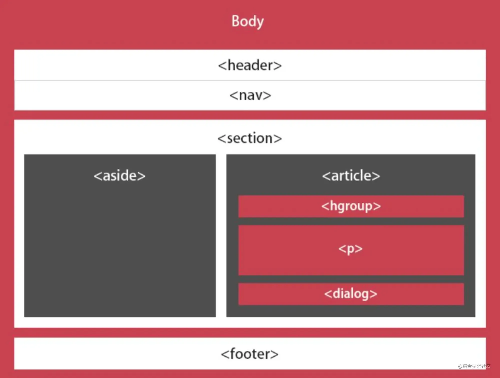

# HTML

## HTML 简介
HTML (Hyper Text Markup Language) 是一种用于创建网页的标记语言。它由许多标签组成，这些标签描述了文档的结构和内容。

## HTML 标签
HTML 标签是由尖括号包围的关键字，如 `<html>、<body>、<p>` 等等。每个 HTML 标签都有一个特定的作用，并且可以通过属性来更改其行为或外观。

例如，在下面的代码段中，`<h1>` 和 `</h1>` 之间的文本将被显示为标题级别1（最大）：

```html
<h1>This is a heading</h1>
```

## HTML 元素
HTML 元素由开始标记、结束标记以及其中间包含的内容组成。开始标记和结束标记必须匹配，并且可以带有属性。

例如，在下面的代码段中，`<p>` 和 `</p>` 之间的文本将被显示为一个段落：

```html
<p>This is a paragraph.</p>
```
## HTML 属性
HTML 属性提供了一种在元素中添加额外信息或配置其行为或外观的方法。每个属性都具有名称和值，并使用等号分隔。

例如，在下面的代码段中，img 元素使用 src 属性来指定图像文件所在位置：

```html

```

## HTML 文档结构
HTML 文档由标记组成，这些标记描述了文档的结构和内容。一个完整的 HTML 文档应该包括以下几个部分：

```html
<!DOCTYPE html>
<html>
<head>
	<title>My Website</title>
</head>
<body>
	<h1>Welcome to my website!</h1>
	<p>This is a paragraph.</p>
</body>
</html>
```

## H5 标签
