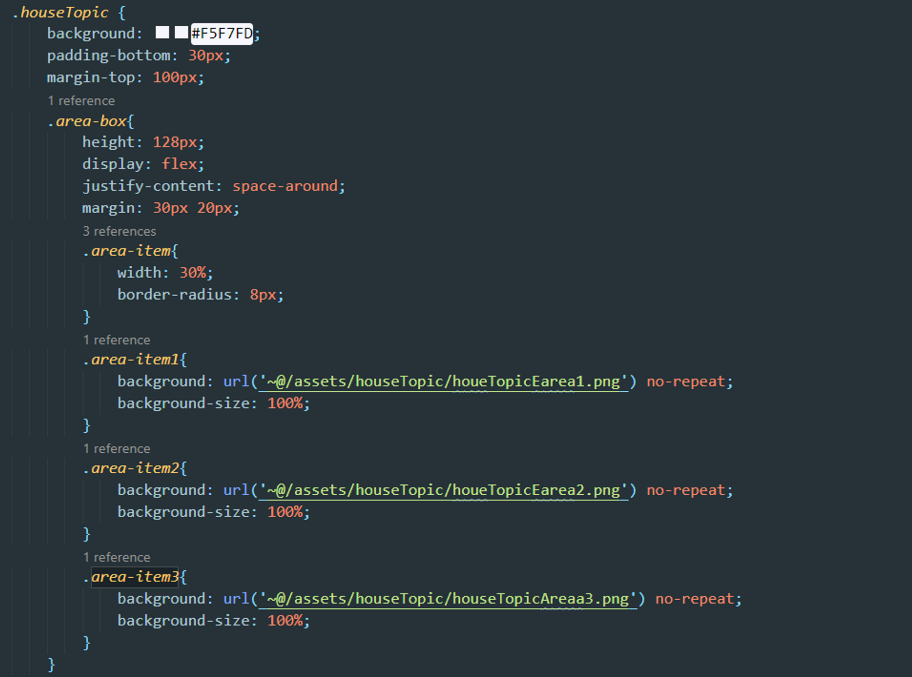

# Vue2 相关

## 关于样式冲突问题

> 多个组件污染（多个组件公用一套样式时影响其他组件）

在开发过程中为了避免不必要的资源浪费，多个组件在会共用一套 CSS 代码时，如果采用下面方法引入，可能会导致组件样式污染（加载组件的时候加载的不是当前组件的样式，必须要刷新一次才能当前组件的样式）

```html
<style scoped>
  @import '../assets/css/Login.css';
</style>
```

那么解决这个问题可以通过下面方法进行引入样式

```html
<style lang="" src="../assets/css/Login.css" scoped></style>
```

## 关于 vue.config.js

```js
module.exports = {
  devServer: {
    port: 8080, // 端口号 可以自定义
    open: true, // 启动项目后自动在浏览器打开项目
    proxy: {
      // 把所有以 /api 开头的请求代理转发
      '/api': {
        target: '', // 目标基础地址 url
        changeOrigin: true, // 允许跨域
        ws: true, // 开启 webSocket 代理
        pathRewrite: {
          // 重写路径
          '^/api': ''
        }
      }
    }
  }
}
```

## 关于冗余导航报错问题

当我们在使用下面方法进行路由跳转时：

```html
<p @click="$router.push('/setting')">设置</p>
```

效果是想点击设置跳转到设置的页面，效果是完全可以正常实现跳转

但是，如果当前已经在`/setting`路由下，那么再点击就会报错：

```shell
[Vue warn]: Error in v-on handler (Promise/async): "NavigationDuplicated: Avoided redundant navigation to current location: "/setting"."
```

大概的意思就是：当前你已经在这个导航下了，不要再重复冗余

这个其实并不是一个错误，只是说你的操作多余了

那么解决方法就是：在 `router/index.js`中加入下面一段代码即可解决报错问题

```js
const router = new VueRouter({
  routes
})

// 解决 冗余导航报错问题
const originalPush = VueRouter.prototype.push
VueRouter.prototype.push = function push(location) {
  return originalPush.call(this, location).catch((err) => err)
}

export default router
```

## 非父子组件通信

1. 通过 EventBus

创建一个叫 `bus.js` 的通信组件，内容如下

```js
import Vue from 'vue'

export default new Vue()
```

假设 a 组件要给 b 组件发送请求，那么 a 组件发布通信事件

```js
import bus from '@/utils/bus.js'
bus.$emit('自定义事件名称', 需要发送的内容)
// 引入 bus，使用 bus.comit() 方法发送数据
```

b 组件要接收通信事件：

```js
import bus from '@/utils/bus.js'
bus.$on('自定义事件名称', (data) => {
  // data 即为传递来的数据
  // 处理函数
})
```

2. 通过 provide 和 inject

```js
// 提供方组件
export default {
  provide() {
    return {
      value: '要传递的值',
      method: this.methodToPass, // 要传递的方法
    };
  },
  methods: {
    methodToPass() {
      // 要传递的方法的实现
    },
  },
};

// 接收方组件
export default {
  inject: ['value', 'method'], // 在这里列出要接收的值和方法
  mounted() {
    console.log(this.value); // 访问传递的值
    this.method(); // 调用传递的方法
  },
};
```

需要注意的是：

> 通信两端所使用的的事件名称必须一致 否则是无效的
> `$on()` 用来接收 `$emit()` 用来发布

## Vue 给 for 循环的标签添加背景图

```html
<div :style="{ 'background-image': 'url(' + item.PlaceImgUrl + ')' }"></div>
```

## watch 监听器

通过 watch 可以定义一个监视器，用于监视某一些数据，当这个被监视的数据一旦发生变化，就会执行里面的逻辑：

```vue
<template>
  <div>
    <input v-model="text" type="text" />
  </div>
</template>

<script>
  export default {
    data() {
      return {
        text: ''
      }
    },
    watch: {
      text() {
        console.log('text 值发生改变了！！')
      }
    }
  }
</script>
```

但是不免有些特殊的情况，比如：我们希望在页面刚刚初始化的时候，虽然数据没有发生变化，但也需要立刻执行一次监视器中的内容，这样的话，监视器的表现形式会变成对象，里面透过配置一个 `handler` 的函数和 `immediate` 方法来解决：

```vue
<template>
  <div>
    <input v-model="text" type="text" />
  </div>
</template>

<script>
  export default {
    data() {
      return {
        text: ''
      }
    },
    watch: {
      // 使用对象写法，监视数据 text
      text: {
        // 使用 handler 方法，处理变化后的逻辑代码
        handler() {
          console.log('text 值发生改变了！！')
        },
        // immediate 这个属性值为 true 的时候，默认页面初始化完成之后执行一次上面的代码
        immediate: true
      }
    }
  }
</script>
```

## vue 中动态绑定 class 和 style 的方法
Class:
1. object
```vue
<div
	class="static"
	:class="{ active: isActive, 'text-danger': hasError }"
></div>
```
2. array
```vue
// method 1:
<div :class="[isActive ? activeClass : '', errorClass]"></div>

// method 2:
<div :class="[{ active: isActive }, errorClass]"></div>
```

Style:
1. object
```js
// html
<div
	style="text-align: center; margin-top: 20px; font-size: 30px"
	:style="{ color: activeColor, fontSize: fontSize + 'px' }">
</div>

// js
data: {
  activeColor: 'red',
  fontSize: 30
}
```
2. array
```js
<div :style="[baseStyles, overridingStyles]"></div>
```

## 插槽

### 默认插槽
```html
<slot></slot>
```
### 具名插槽
```vue
声明：<slot name='cyan'>这里的内容将被下方 template 中的内容替代</slot>

使用：<template v-slot:cyan> 替代上面的slot标签中的内容 </template>
```
### 作用域插槽
```vue
声明：<slot :user="user"> {{ user.lastName }} </slot>

使用：<template v-slot:default="slotProps"> {{ slotProps.user.firstName }} <template>
```
### 废弃的语法
```vue
<template slot="default" slot-scope="slotProps">
   {{ slotProps.msg }}
</template>
```

## vue2中使用图片的方式

### 在 style 标签中使用


### 在 template 中使用


### 在 echarts 地图中使用


## 有3个页面A,B,C, A是列表页, B是表单页, C是表单确认页

### 如何实现当用户从A跳转到B, 在B填写完表单进入C后, 再从C返回B时, 表单数据依然存在.

在B的路由配置中加上 meta 属性, 如下:
```js
meta: { title: '数据申请', isUseCache: true }
```

在B页面的 activated 以及 beforeRouteLeave 生命周期中添加以下代码:
```js
activated() {
  if (!this.$route.meta.isUseCache) {
    // 重新发送网络请求或初始化数据等操作
  } else {
    this.$route.meta.isUseCache = false
  }
},
beforeRouteLeave(to, from, next) {
  // 其中 CName 是C页面的组件名称
  if (to.name === 'CName') {
    from.meta.isUseCache = true
  } else {
    from.meta.isUseCache = false
  }
  next()
},
```

在C页面提交表单后返回A页面时, 要将 isUseCache 置为 false, 这样再从A回到B时, 表单数据就不会是上一次缓存的了.
```js
// 从路由配置中找到A页面的路由对象
const DataServiceRouter = constantRoutes.find(item => item.path === '/data-services')
const DataServiceApply = DataServiceRouter.children.find(item => item.name === 'DataServiceApply')
// 将 isUseCache 置为 false
DataServiceApply.meta.isUseCache = false
```


